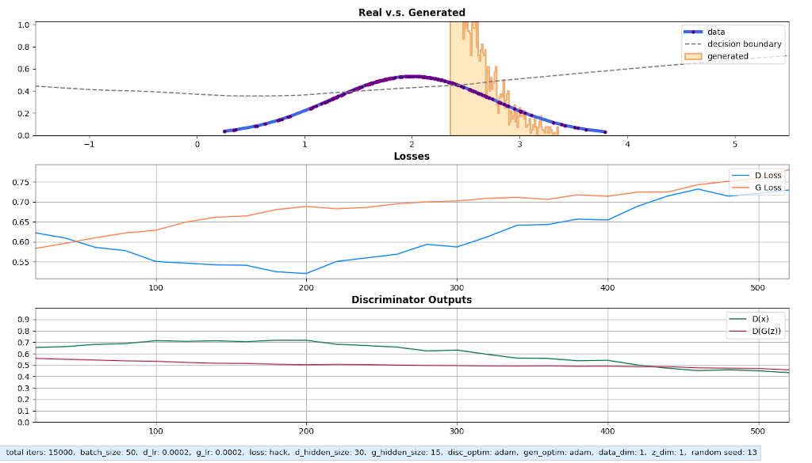

# **GANs Experiments**
This code was written using the PyTorch and contains several straightforward examples of Generative Adversarial Networks (GANs) consists of experiments on synthetics data and the MNIST dataset.

<br>  

#### **Requirements:**
* python 3.6+
* pytorch 1.4+
* torchvision
* matplotlib

<br>  

#### **Running the code:**
```
python 1d_gaussian.py
# or   
python mnist.py
```  
You can pass `1` (or any non-zero number) as a cmd parameter to save information about an experiment or save an image for each plot as training proceeds. For this purpose, two options exist at the beginning of each experiment's code: `save_model` to save information about the model configuration and `save_figs` to save plot shots.  

  
